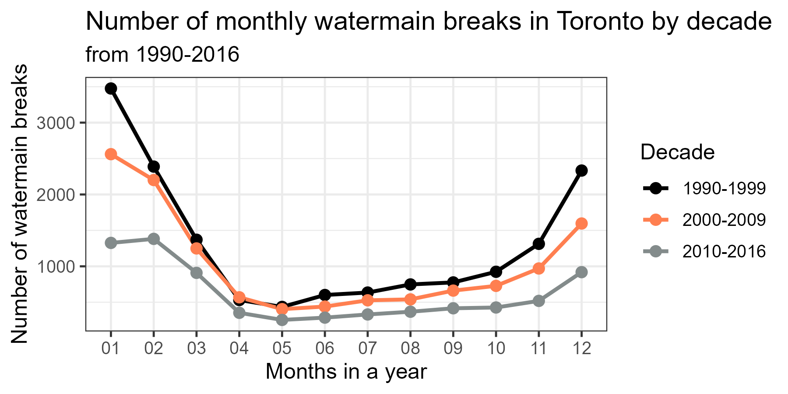
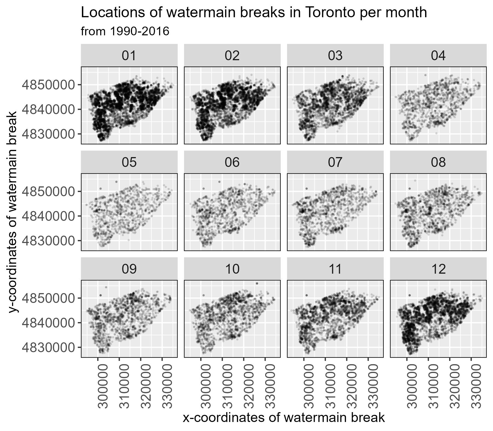

# Data Visualization

## Assignment 3: Final Project

### Requirements:
- We will finish this class by giving you the chance to use what you have learned in a practical context, by creating data visualizations from raw data. 
- Choose a dataset of interest from the [City of Toronto’s Open Data Portal](https://www.toronto.ca/city-government/data-research-maps/open-data/) or [Ontario’s Open Data Catalogue](https://data.ontario.ca/). 
- Using Python and one other data visualization software (Excel or free alternative, Tableau Public, any other tool you prefer), create two distinct visualizations from your dataset of choice.  
- For each visualization, describe and justify: 
    > What software did you use to create your data visualization?

    > Who is your intended audience? 
    
    > What information or message are you trying to convey with your visualization? 
    
    > What aspects of design did you consider when making your visualization? How did you apply them? With what elements of your plots? 
    
    > How did you ensure that your data visualizations are reproducible? If the tool you used to make your data visualization is not reproducible, how will this impact your data visualization? 
    
    > How did you ensure that your data visualization is accessible?  
    
    > Who are the individuals and communities who might be impacted by your visualization?  
    
    > How did you choose which features of your chosen dataset to include or exclude from your visualization? 
    
    > What ‘underwater labour’ contributed to your final data visualization product?

- This assignment is intentionally open-ended - you are free to create static or dynamic data visualizations, maps, or whatever form of data visualization you think best communicates your information to your audience of choice! 
- Total word count should not exceed **(as a maximum) 1000 words** 
 
### Response

**Dataset:** Watermain Breaks
- Source: https://open.toronto.ca/dataset/watermain-breaks/

#### **Plot 1:**

> **What software did you use to create your data visualization?** R and RStudio.

> **Who is your intended audience?** Researchers and city planners studying urban infrastructure. 

> **What information or message are you trying to convey with your visualization?** That the total number of monthly watermain breaks are similar across the (approximate) decades of data collection. In fact, watermain breaks have decreased slightly over the years across every month.  

> **What aspects of design did you consider when making your visualization? How did you apply them? With what elements of your plots?** I considered the best type of plot to display changes over time (i.e. across the months of a year). Line graphs were most ideal for such data. Because I wanted to look at differences between years, I had to decide on a timespan that was logical but allowed for easy comparison; too short of a timespan meant too many groups, making the data visually difficult to parse (unless there were significant differences) while too long of a timespan resulted in too few groupings that made comparison pointless. I settled on grouping the data into decades which allowed for meaningful comparisons across a reasonable number of groups (3 decades). Decades were encoded using different colours, which I specifically chose to be high contrast against each other with hues chosen to be accessible for people with colour-blindness. Informative titles and axis labels were added at a reasonable font size.

> **How did you ensure that your data visualizations are reproducible? If the tool you used to make your data visualization is not reproducible, how will this impact your data visualization?** I created a folder called `assignment_3_files`. Inside this folder, I also created the R-script `assignment_3_visualization_script.r` and the R-project `assignment_3_files.Rproj`. The relevant dataset is also placed inside the folder. Once the R-project is loaded into RStudio, a user can run the R-script which performs 2 main tasks: (1) read and clean/format the data and (2) generate relevant plots and save them into the folder. The only change that a user may have to make is to install the libraries listed at the top of the script if they do not have them installed.  

> **How did you ensure that your data visualization is accessible?** As mentioned previously, colours were chosen so that they were high contrast against both the background and with each other. Particular hues were also chosen to be accessible for people with colour blindness. All text was set to a readable font and font size. Lines and points on the plot itself were also chosen to be thicker/bigger so that they could be clearly seen. 

> **Who are the individuals and communities who might be impacted by your visualization?** Anyone who lives in Toronto who uses the city's water system. This kind of graph coulde be used to decide funding allocated for replacing watermain breaks as well as decideing the time of year where the largest number of repairs is to be expected. 

> **How did you choose which features of your chosen dataset to include or exclude from your visualization?** There were only 4 features in my dataset to begin with: date of watermain break, year of watermain break, x-coordinate of watermain break, y-coordinate of watermain break. Because I was only interested in the number of watermain breaks over time, I had set aside the location features and focused only on formatting the date features. Using the date feature, I extract the month of the date. Using the year feature, I grouped breaks into decades. 

> **What ‘underwater labour’ contributed to your final data visualization product?** Given the large number of datapoints recorded over such a long period of time (35,465 total breaks over 27 years), this data was likely documented by repair staff, then aggregated and cleaned city staff. Given that the data begins in 1990, a significant portion of the data likely began as physical records which then had to be digitized by staff. Locations in the dataset are also encoded as x- and y-coordinates, but where likely addresses in the original record, which means that labour also went into converting this information. 

**Plot 2:**

> **What software did you use to create your data visualization?** R and RStudio.

> **Who is your intended audience?** Researchers and city planners studying urban infrastructure. 

> **What information or message are you trying to convey with your visualization?** that the most common locations for watermain breaks tend to be on the west and north side of Toronto and that these tend to pop up during the winter months (November-February). While the remainder of the year have observably fewer breaks, there are clusters of breaks that appear along the most southern edges of the city during the summer months (June-August).  

> **What aspects of design did you consider when making your visualization? How did you apply them? With what elements of your plots?** Given that the visualization would depict both temporal data and geographic data, I had to consider how to best depict these attributes. First, each break is represented as a point whose location is encoded in the x- and y-axis. Because of the sheer number of data points, each point was set to be slightly transparent and small so that viewers could actually distinguish areas with more vs. fewer breaks. To encode the months of the year, I decided to use faceting instead of having everything on the same plot. That way, you can more clearly see changes over time while also observing the geographic distribution of breaks within a given month. 

> **How did you ensure that your data visualizations are reproducible? If the tool you used to make your data visualization is not reproducible, how will this impact your data visualization?** I created a folder called `assignment_3_files`. Inside this folder, I also created the R-script `assignment_3_visualization_script.r` and the R-project `assignment_3_files.Rproj`. The relevant dataset is also placed inside the folder. Once the R-project is loaded into RStudio, a user can run the R-script which performs 2 main tasks: (1) read and clean/format the data and (2) generate relevant plots and save them into the folder. The only change that a user may have to make is to install the libraries listed at the top of the script if they do not have them installed.  

> **How did you ensure that your data visualization is accessible?** Colours were chosen to be highly contrastive against the background. Facets were organized in a logical manner. All text was set to a readable font and font size.  

> **Who are the individuals and communities who might be impacted by your visualization?** Anyone who lives in Toronto who uses the city's water system as well as city staff responsible for repairing breaks. This kind of graph coulde be used to decide the time of year and areas where the largest number of repairs are to be expected. 

> **How did you choose which features of your chosen dataset to include or exclude from your visualization?** There were only 4 features in my dataset to begin with: date of watermain break, year of watermain break, x-coordinate of watermain break, y-coordinate of watermain break. I was interested in both temporal and geographical changes, so I chose to use the x- and y-coordinates as well as extract the month of the year from the date feature. 

> **What ‘underwater labour’ contributed to your final data visualization product?** Given the large number of datapoints recorded over such a long period of time (35,465 total breaks over 27 years), this data was likely documented by repair staff, then aggregated and cleaned city staff. Given that the data begins in 1990, a significant portion of the data likely began as physical records which then had to be digitized by staff. Locations in the dataset are also encoded as x- and y-coordinates, but where likely addresses in the original record, which means that labour also went into converting this information. 

### Why am I doing this assignment?:  
- This ongoing assignment ensures active participation in the course, and assesses the learning outcomes: 
* Create and customize data visualizations from start to finish in Python
* Apply general design principles to create accessible and equitable data visualizations
* Use data visualization to tell a story  
- This would be a great project to include in your GitHub Portfolio – put in the effort to make it something worthy of showing prospective employers!

### Rubric:

| Component         | Scoring  | Requirement                                                                 |
|-------------------|----------|-----------------------------------------------------------------------------|
| Data Visualizations | Complete/Incomplete | - Data visualizations are distinct from each other - Data visualizations are clearly identified - Different sources/rationales (text with two images of data, if visualizations are labeled) - High-quality visuals (high resolution and clear data) - Data visualizations follow best practices of accessibility |
| Written Explanations | Complete/Incomplete | - All questions from assignment description are answered for each visualization - Explanations are supported by course content or scholarly sources, where needed |
| Code              | Complete/Incomplete | - All code is included as an appendix with your final submissions - Code is clearly commented and reproducible |

## Submission Information

🚨 **Please review our [Assignment Submission Guide](https://github.com/UofT-DSI/onboarding/blob/main/onboarding_documents/submissions.md)** 🚨 for detailed instructions on how to format, branch, and submit your work. Following these guidelines is crucial for your submissions to be evaluated correctly.

### Submission Parameters:
* Submission Due Date: `23:59 - 09/05/2025`
* The branch name for your repo should be: `assignment-3`
* What to submit for this assignment:
    * A folder/directory containing:
        * This file (assignment_3.md)
        * Two data visualizations 
        * Two markdown files for each both visualizations with their written descriptions.
        * Link to your dataset of choice.
        * Complete and commented code as an appendix (for your visualization made with Python, and for the other, if relevant) 
* What the pull request link should look like for this assignment: `https://github.com/<your_github_username>/visualization/pull/<pr_id>`
    * Open a private window in your browser. Copy and paste the link to your pull request into the address bar. Make sure you can see your pull request properly. This helps the technical facilitator and learning support staff review your submission easily.

Checklist:
- [ ] Create a branch called `assignment-3`.
- [ ] Ensure that the repository is public.
- [ ] Review [the PR description guidelines](https://github.com/UofT-DSI/onboarding/blob/main/onboarding_documents/submissions.md#guidelines-for-pull-request-descriptions) and adhere to them.
- [ ] Verify that the link is accessible in a private browser window.

If you encounter any difficulties or have questions, please don't hesitate to reach out to our team via our Slack. Our Technical Facilitators and Learning Support staff are here to help you navigate any challenges.
